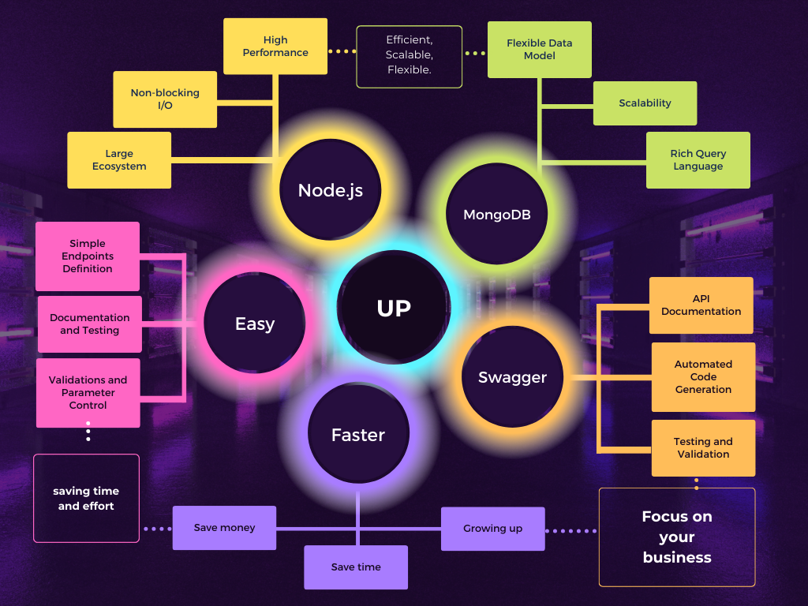
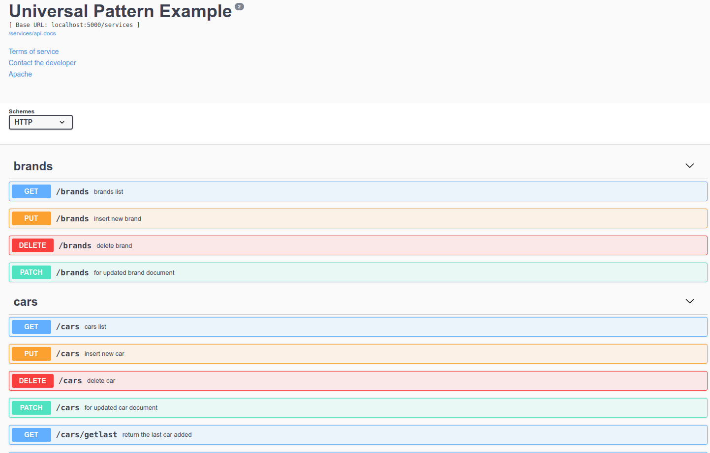

Powered by [Cesar Casas](https://www.linkedin.com/in/cesarcasas)


# Contenido

- [Contenido](#contenido)
- [Universal Pattern 💻](#universal-pattern-)
	- [📚 Características Destacadas](#-características-destacadas)
		- [Definición Sencilla de Módulos y Endpoints](#definición-sencilla-de-módulos-y-endpoints)
		- [Integración Automatizada con Swagger para Documentación y Pruebas](#integración-automatizada-con-swagger-para-documentación-y-pruebas)
		- [Automatización de Validaciones y Control de Parámetros](#automatización-de-validaciones-y-control-de-parámetros)
	- [📋 Requerimientos](#-requerimientos)
- [💻 Instalación](#-instalación)
- [👨‍💼 Primer modulo](#-primer-modulo)
	- [Crear directorios](#crear-directorios)
	- [Creando module yaml](#creando-module-yaml)
	- [Creamos app.js](#creamos-appjs)
	- [Ejecutando!](#ejecutando)
- [Preguntas frecuentes](#preguntas-frecuentes)
	- [👨‍💻 Arquitectura y Flujo de Trabajo](#-arquitectura-y-flujo-de-trabajo)
	- [👨‍💻 Personalización y Extensibilidad](#-personalización-y-extensibilidad)
	- [🛡️ Seguridad y Autenticación](#️-seguridad-y-autenticación)
	- [👨‍💻 Rendimiento y Escalabilidad](#-rendimiento-y-escalabilidad)
	- [👨‍💻 Soporte y Comunidad](#-soporte-y-comunidad)
- [x-swagger-properties](#x-swagger-properties)
	- [x-swagger-public-field](#x-swagger-public-field)
	- [x-swagger-router-controller](#x-swagger-router-controller)
- [Clustering.](#clustering)
- [Performance testing](#performance-testing)
- [Ejemplo](#ejemplo)
- [License](#license)


# Universal Pattern 💻


Universal Pattern es una librería que permite de una forma muy simple crear microservicios y endpoint utilizando [Node.js](https://nodejs.org), [Swagger](https://editor.swagger.io) y [MongoDB](https://www.mongodb.com/).

El concepto principal es crear archivos `yaml` que denerán estar alojados en el directorio `swagger`.
Cada archivo `yaml` representa un módulo para Universal Pattern.
Por ejemplo, si queremos crear un ABM de `brands`, debemos crear un archivo llamando `brands.yaml` dentro del directorio swagger.

Dentro de la definición del archivo swagger, estableceremos los distintos endpoints (ruta + método http).
Podemos definir que tipo de datos de entrada necesitamos, y cual será el dato de salida.

Como ya se estará dando cuenta, el propócito de Universal Pattern es poder definir módulos y que los mismos funcionen, sin necesidad de programación adicional (es decir, no tener que escribir el código de los módulos).

## 📚 Características Destacadas

- Alta velocidad de desarrollo
- Documentar es darle vida a los endpoints
- Validaciones
- Swagger con esteroides!
- Poder probar los endpoints en el mismo servicio! solo accediendo al directorio `/docs`


### Definición Sencilla de Módulos y Endpoints

Universal Pattern permite a los desarrolladores definir módulos y endpoints de manera sencilla y eficiente a través de archivos YAML. Esta característica reduce significativamente la complejidad y el tiempo necesario para configurar nuevos servicios y rutas. Al no requerir programación adicional para la creación de estos módulos, facilita enormemente el proceso de desarrollo, especialmente para aquellos que no son expertos en Node.js o MongoDB.

```yaml
paths:
  /cars:
    get:
      tags:
        - cars
      summary: cars list
      x-swagger-router-controller: universal.search
      parameters:
        - $ref: '#/parameters/q'
        - $ref: '#/parameters/page'
        - $ref: '#/parameters/sorting'
        - $ref: '#/parameters/limit'
        - $ref: '#/parameters/fields'

      responses:
        '200':
          description: cars list
          schema:
            $ref: '#/definitions/car'
```


### Integración Automatizada con Swagger para Documentación y Pruebas

La herramienta integra de manera nativa la documentación y las pruebas de endpoints a través de Swagger. Esto significa que los desarrolladores pueden generar y actualizar la documentación de su API de forma automática, así como probar los endpoints directamente desde la interfaz de Swagger. Esta integración elimina la necesidad de herramientas o procesos adicionales para la documentación y prueba de APIs, lo que simplifica considerablemente el mantenimiento y la gestión de la API.



### Automatización de Validaciones y Control de Parámetros

Universal Pattern maneja automáticamente las validaciones y el control de parámetros para los endpoints definidos. Esto reduce la carga de tener que escribir y mantener código adicional para la validación de datos, asegurando que los datos entrantes cumplan con los requisitos especificados en los archivos YAML. Esta automatización ayuda a prevenir errores comunes y mejora la robustez de la aplicación sin esfuerzo adicional por parte del desarrollador.

```yaml
definitions:
  feedInput:
    type: object
    properties:
      body:
        type: string
        required: true
        minLength: 4
      rate:
        type: integer
        required: true
        max: 5
        min: 1
        decimals: 0
      userId:
        type: string
        format: mongoId
        x-swagger-lookup:
          collection: users
          populate:
            - _id
            - firstname
            - lastname
            - avatar
      carId:
        type: string
        format: mongoId
        x-swagger-lookup:
          collection: cars
          populate:
            - _id
            - name
            - color
            - brands.name
```

## 📋 Requerimientos
Antes de comenzar a trabajar con Universal Pattern, debemos tener instalado previamente

- Node.js (version 18 o superior)
- MongoDB 6 o superior

# 💻 Instalación
Recomendamos utilizar Universal Pattern desde un entorno Linux, aunque funcionará sin problemas en entornos Windows y MacOS.

```bash
$ npm install universal-pattern --save
```

Es importante entender que para trabajar con Universal Pattern deberemos crear una estructura básica de archivos y directorios.

```
SuProyecto/
	├ swagger/			# Directorio donde guardaremos nuestros archivos yaml (módulos)
	├ controllers/		# Directorio donde se guardan los controladores customizados
	├ hooks/			# Directorio donde se guarda los hooks customizados
	├ app.js			# nuestro archivo de aplicación
	├ package.json
```

# 👨‍💼 Primer modulo
🎉 Vamos a crear tu primer módulo con Universal Pattern.
Primero que nada crearemos un proyecto nuevo utilizando npm (el manejador de paquetes de Node.js, deberán tenerlo instalado).
Recuerde que es necesario tener instalado Node.js version 20 o superior y MongoDB version 6 o superior.


```bash
$ mkdir up-example
$ cd up-example
$ npm init
```

El comando npm init nos hará una seríe de preguntas.

- package name: dejamos el que está por default (up-example), presionamos enter
- version: presionamos enter.
- description: podemos indicar o no una descripción, es opcional.
- entry point: aquí ingresaremos "app.js"
- test command: aquí ingresaremos "node".
- git repository: nos está preguntando cual será el path o url de nuestro repositorio de git. Presionamos enter.
- keywords: presionamos enter
- author: ingresamos nuestro nombre
- license: presionamos enter
- Is this OK?: presionamos enter

## Crear directorios

```bash
$ mkdir swagger
$ mkdir controllers
$ mkdir hooks
$ npm install universal-pattern --save
```

## Creando module yaml
Ahora crearemos el archivo `models.yaml` dentro del directorio `swagger` con el siguiente contenido.

```yaml
paths:
  /models:
    get:
      tags:
        - models
      summary: models list
      x-swagger-router-controller: universal.search
      parameters:
        - $ref: '#/parameters/q'
        - $ref: '#/parameters/page'
        - $ref: '#/parameters/sorting'
        - $ref: '#/parameters/limit'
        - $ref: '#/parameters/fields'

      responses:
        '200':
          description: reports
          schema:
            $ref: '#/definitions/models'
    put:
      tags:
        - models
      summary: insert new model
      x-swagger-router-controller: universal.insert
      parameters:
        - name: modeldata
          in: body
          required: true
          schema:
            $ref: '#/definitions/modelInput'
      responses:
        '200':
          description: model added
          schema:
            $ref: '#/definitions/models'

    delete:
      tags:
        - models
      summary: delete model
      x-swagger-router-controller: universal.remove
      parameters:
        - $ref: '#/definitions/by_id'
      responses:
        '200':
          description: deleted model
          schema:
            $ref: '#/definitions/models'

    patch:
      tags:
        - models
      summary: for updated model document
      x-swagger-router-controller: universal.update
      parameters:
        - name: modeldata
          in: body
          required: true
          schema:
            $ref: '#/definitions/modelUpdate'
      responses:
        '200':
          description: updated model
          schema:
            $ref: '#/definitions/models'

definitions:
  modelInput:
    x-swagger-model-version: 2
    type: object
    properties:
      name:
        type: string
        required: true
        minLength: 4
      description:
        type: string
      scoring:
        type: integer
        decimal: 0
        requied: true
        min: 1
        max: 100

  modelUpdate:
    type: object
    properties:
      _id:
        type: string
        format: mongoId

  models:
    type: object
    properties:
      name:
        type: string
      description:
        type: string
      scoring:
        type: integer

```

## Creamos app.js
Ahora es momento de crear el archivo `app.js` que tendrá el siguiente contenido:

```javascript
const path = require('node:path');
const up = require('universal-pattern');
const swaggerFolder = path.join(process.cwd(), 'swagger'); // definimos el directorio swagger
const params = {
	swagger: {
		baseDoc: process.env.BASEPATH, // es el directorio base de nuestro servicios. Ej: '/services'
		host: `${process.env.HOST}:${process.env.PORT}`, // el host, default localhost.
		folder: swaggerFolder, // el directorio swagger
		info: {
			version: 2.0,
			title: 'Universal Pattern Example',
			termsOfService: 'www.domain.com/terms',
			contact: {
				email: 'cesar@visiongroup.nyc',
			},
			license: {
				name: 'Apache',
				url: 'http://www.apache.org/licenses/LICENSE-2.0.html',
			},
		},
	},
	preMWS: [], // array con middleware que se ejecutarán antes que Universal Pattern
	postMWS: [], // array con middleware que se ejecutarán despues del flow request de UP.
	bodyParser: { // configuraciones para el MWS bodyParser.
		json: { limit: '2mb' }, // seteamos el limit del tamaño de los objetos enviados por body
		urlencoded: { limit: '500mb', extended: false },
	},
	express: { // configuraciones adicionales de express
		json: { limit: 10485760 }, // límite del json
		static: 'public', // directorio público.
	},
	compress: true, // indica que el output deberá estar comprimido
	cors: true, // habilita cors
	production: false, // indica si está en modo producción. En modo producción no se permite el acceso a la documentación
	routeController: (req, res, next) => next(), // controlador a ejecutar antes que cualquier otro controlador.
	port: process.env.PORT, // puerto donde correrá nuestro servicio
	database: { // la configuración de la base de datos.
		uri: process.env.CONNECTION, // string de connection a la base de datos
		name: process.env.DBNAME, // nombre de la base de datos
	},
	enabledStats: true, // activa el modo stats, el cual podemos consumir en el path `/stats`
};

async function init() {
	try {
		const upInstance = await up(params); // creamos una instancia de UP
		console.info(`UP InstanceId: ${upInstance.instanceId}`);
	} catch (err) {
		console.error('Error initializing ', err);
	}
}

init(); // iniciamos nuestro servicio
```


## Ejecutando!
Ahora vamos a ejecutar nuestro ejemplo.

```bash
$ node app.js
HOST=localhost PORT=5000 CONNECTION=mongodb://127.0.0.1:27017 DBNAME=uptesting BASEPATH=/services node app.js
```

Abrimos nuestro navegador en la siguiente url (http://localhost:5000/services/docs) y veremos la documentación de nuestro nuevo módulo (y obviamente, podremos probarlo!)

# Preguntas frecuentes

## 👨‍💻 Arquitectura y Flujo de Trabajo
```
¿Podrías explicar un poco más sobre cómo Universal Pattern interactúa con Node.js, Swagger y MongoDB en un flujo de trabajo típico?.
```

Univiersal Pattern se ingregra a un proyecto Node.js como una librería, permitiendo leer un directorio `swagger` con los archivos yaml.
Recordemos que el objetivo es que cada archivo `yaml` represente un `module`.

Lo que hará Universal Patter es leer cada archivo yaml y registrar en Express (el cual gestiona internamente) las rutas, el control de parámetros de entrada a las mismas y todo aquel mecanismo que sea necesario.

Universal Pattern entiende que cada módulo es una `collection` en la base de datos, por esa razón es importante entender que la ruta está directamente relacionada a la collection.

Por ejemplo:
`http://localhost:3000/services/users`

En este caso debemos tener en cuenta:

- `/services` es considerado el `basepath`, es decir, la ruta donde estará UP corriendo.
- `/users` es el module, es decir, para Universal Pattern la collection en MongoDB se llamará `users`.


## 👨‍💻 Personalización y Extensibilidad
```
¿Hay opciones para personalizar o extender la funcionalidad de los módulos generados por Universal Pattern? Por ejemplo, ¿cómo se manejarían casos en los que se necesiten lógicas de negocio específicas o integraciones con otros sistemas?
```

Universal Pattern ofrece controladores ya pre-definidos para ahorrar tiempo y esfuerzo.

Cuando definimos un nuevo endpoint, debemos indicar por medio de la prop `x-swagger-router-controller` cual será el controlador (nombre del mismo).

```yaml
paths:
  /brands:
    get:
      tags:
        - brands
      summary: brands list
      x-swagger-router-controller: universal.search
      parameters:
        - $ref: '#/parameters/q'
        - $ref: '#/parameters/page'
        - $ref: '#/parameters/sorting'
        - $ref: '#/parameters/limit'
        - $ref: '#/parameters/fields'

      responses:
        '200':
          description: return all brand from database
          schema:
            $ref: '#/definitions/brand'
```

Universal pattern nos aporta controladores como:

- universal.search: busca dentro de la collection, y retornará el resultado en forma paginado.
- universal.insert: permitirá insertar información, agregando una capa de control de datos.
- universal.update: actualiza un documento en la collection.
- universal.remove: elimina un documento de la collection.
- universal.count: cuenta los documentos de una collection.
- universal.today: retorna todos los documentos del día actual.
- universal.getLast: retorna el último documento de una collection.
- universal.distinct: retorna todos los valores distintos de la field indicada.
- universal.insertOrCount: intentará insertar un documento siempre y cuando el key/value indicado no exista previamente. En caso de que exista, retornará error, pero sumará en 1 la prop `_count`.

Adicionalmente, Universal Pattern permite definir controladores propios, a fin de que podamos aplicar las reglas de negocio que necesitemos.


```javascript
upInstance.registerController('MyMoudleName.ControllerName', (req, res, next) => {
  console.info(req.swagger);
  res.json({ ok: true });
});
```

Recomendamos crear los archivos de controladores propios dentro del directorio `controllers` a la misma altura que el directorio `swagger`.

`upInstance` es la instancia de Universal Pattern una vez creada.

```javascript
async function init() {
	try {
		const upInstance = await up(params);
		console.info(`UP InstanceId: ${upInstance.instanceId}`);
	} catch (err) {
		console.error('Error initializing ', err);
	}
}
```

## 🛡️ Seguridad y Autenticación
```
¿Universal Pattern ofrece características integradas para manejar la seguridad y autenticación en los endpoints, o esto debe ser implementado aparte?
```

Universal Pattern si bien no ofrece (de momento) mecanismos para seguridad, autentificación, etc. aporta una manera muy simple de lograrlo.

Podemos crear un `mws` para decodificar un `jwt` y gracias a la propiedad `routeController` podemos aplicar reglas antes de que se llegue a los controladores definidos en los módulos.

## 👨‍💻 Rendimiento y Escalabilidad
```
¿Hay alguna consideración especial en términos de rendimiento y escalabilidad cuando se utilizan microservicios generados con Universal Pattern, especialmente en aplicaciones de gran escala?
```
En este sentido, tenemos varios puntos a considerar.

- MongoDB: podemos escalar la base de datos con todas las opciones disponibles de MongoDB (sharding, clustering, etc).
- Múltiples instancias: con la ayuda de un `ELB` o cualquier otra opción de balance, podemos instalar nuestros servicios (grupo de módulos) en distintos servidores y balancear la carga.
- Múltiples core: por default, Universal Patter ya reconoce el total de cores que tiene nuestro servidor y aprovechará cada uno de ellos.

## 👨‍💻 Soporte y Comunidad
```
¿Cómo es el soporte y la comunidad alrededor de Universal Pattern? ¿Hay una base de usuarios activa o foros donde los desarrolladores pueden buscar ayuda y compartir mejores prácticas?
```
- Comunidad en [Telegram](https://t.me/universalpattern).
- Comunidad en [Linkedin](https://www.linkedin.com/groups/9580792/)

Adicionalmente, pueden visitar el repositorio en [github](https://github.com/visiongroupnyc/universal-pattern/issues)


# x-swagger-properties

## x-swagger-public-field
Indica que propiedades se deben popular en la respuesta de un endpoint.

```yaml
paths:
  /users:
    get:
      tags:
        - users
      summary: users list
      x-swagger-router-controller: universal.search
      x-swagger-public-field:
        - firstName
        - lastName
      parameters:
        - $ref: '#/parameters/q'
        - $ref: '#/parameters/page'
        - $ref: '#/parameters/sorting'
        - $ref: '#/parameters/limit'
        - $ref: '#/parameters/fields'
```

## x-swagger-router-controller
Indica el nombre del controlador que deseamos utilizar.
El mismo puede ser propio de universal pattern o uno creado de forma customizada.
A continuación, el listado de controladores soportados en Universal Pattern.
- [insert](./docs/controllers/INSERT.md)
- [search](./docs/controllers/SEARCH.md)
- [remove](./docs/controllers/REMOVE.md)
- [count](./docs/controllers/COUNT.md)
- [today](./docs/controllers/TODAY.md)
- [getLast](./docs/controllers/GETLAST.md)


# Clustering.
Universal Pattern de forma automática utilizará el módulo clustering de Node.js, creando fork por cada core disponible.

# Performance testing
Usando autocannon para medir la performance del example incluido en Universal Pattern
```bash
$ autocannon "http://localhost:5000/services/users?page=1&limit=30"
```

```bash
Running 10s test @ http://localhost:5000/services/users?page=1&limit=30
10 connections


┌─────────┬──────┬──────┬───────┬──────┬─────────┬─────────┬───────┐
│ Stat    │ 2.5% │ 50%  │ 97.5% │ 99%  │ Avg     │ Stdev   │ Max   │
├─────────┼──────┼──────┼───────┼──────┼─────────┼─────────┼───────┤
│ Latency │ 1 ms │ 1 ms │ 4 ms  │ 5 ms │ 1.48 ms │ 0.94 ms │ 23 ms │
└─────────┴──────┴──────┴───────┴──────┴─────────┴─────────┴───────┘
┌───────────┬─────────┬─────────┬─────────┬─────────┬─────────┬─────────┬─────────┐
│ Stat      │ 1%      │ 2.5%    │ 50%     │ 97.5%   │ Avg     │ Stdev   │ Min     │
├───────────┼─────────┼─────────┼─────────┼─────────┼─────────┼─────────┼─────────┤
│ Req/Sec   │ 3,239   │ 3,239   │ 5,099   │ 6,279   │ 5,088.5 │ 876.53  │ 3,239   │
├───────────┼─────────┼─────────┼─────────┼─────────┼─────────┼─────────┼─────────┤
│ Bytes/Sec │ 4.36 MB │ 4.36 MB │ 6.86 MB │ 8.45 MB │ 6.84 MB │ 1.18 MB │ 4.36 MB │
└───────────┴─────────┴─────────┴─────────┴─────────┴─────────┴─────────┴─────────┘

Req/Bytes counts sampled once per second.
# of samples: 10

51k requests in 10.02s, 68.4 MB read
```

# Ejemplo
Podemos ver un ejemplo completo de implementación en [este link](example/README.md)

# License
[MIT](LICENSE)
